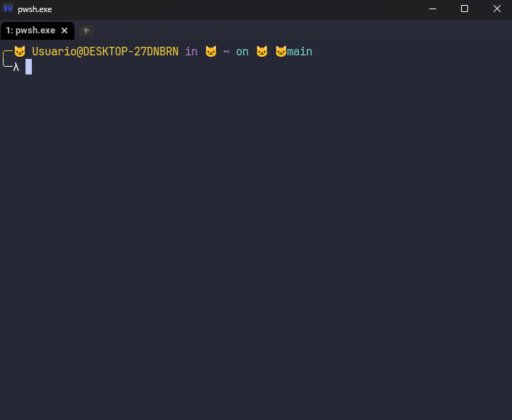

# wezterm

Your favorite theme in wezterm

Installation is very simple, just follow these steps

```shell
git clone https://github.com/neko-night/wezterm

cd wezterm
mv nekonight.toml ~/.config/wezterm/colors
```

then go into your favorite text editor, and type this line

```lua
color_scheme = "nekonight",
```


